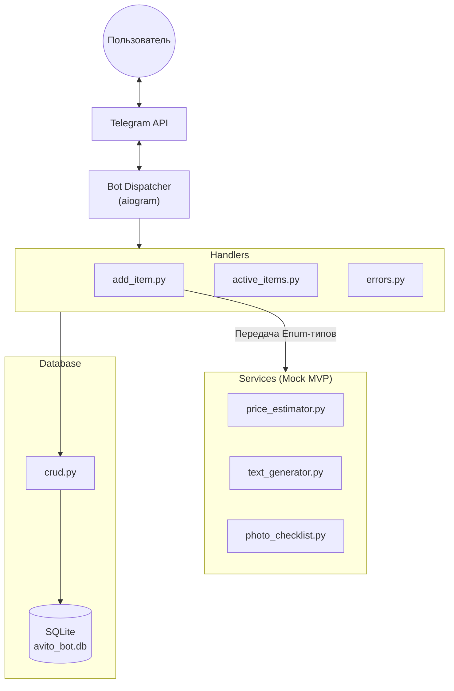

# Avito Mom Bot 🧸

Telegram-бот — умный помощник для занятых родителей, который упрощает процесс продажи и отдачи детских вещей на Авито. 

## Особенности и функционал
- 📝 **Сбор информации:** Бот в формате интерактивного диалога собирает все необходимые детали о детской вещи (категория, состояние, бренд).
- 🏷 **Генерация объявлений:** Автоматически создает честные, но привлекательные тексты для объявлений вашей площадки.
- 💰 **Оценка стоимости:** Примерная оценка оптимальной цены на основе введенных характеристик вещи, а также прогнозирование вероятных сроков продажи.
- 📸 **Чек-листы для фото:** Подсказки, как правильно сфотографировать конкретную вещь, чтобы выделить ее на фоне остальных.
- 📊 **Отслеживание объявлений:** Возможность сохранять ссылки на опубликованные объявления и отслеживать их текущий статус.

## Архитектура решения

Проект построен по слоистой (layered) архитектуре, что позволяет легко заменить временные моки (MVP) на реальные интеграции с Авито в будущем.



1. **Telegram API & Handlers:** Обрабатывают входящие сообщения и стейт-машину (FSM). Они валидируют ввод и преобразуют пользовательский текст в строгие системные типы (Enums).
2. **Services (Mock MVP):** Чистая бизнес-логика. На данном этапе внутри находятся "заглушки" (вместо нейросетей — эвристики и захардкоженные цены). Сервисы ничего не знают про Телеграм и работают только со своими аргументами в виде нормализованных типов `Enum`, возвращая финальный текст и цены.
3. **Database (CRUD):** Слой абстракции над SQLAlchemy. Хендлеры отправляют в CRUD базовые типы (строки/числа). Значения Enum могут быть сохранены в виде строк, и CRUD управляет логикой записи в SQLite.

## Стек технологий
- **Язык разработки:** Python 3.9+
- **База данных:** SQLite
- **ORM:** SQLAlchemy

## Установка и запуск (для разработчиков)

1. **Клонируйте репозиторий:**
   ```bash
   git clone https://github.com/alinaappleaseeva-sys/avito_mom_bot.git
   cd avito_mom_bot
   ```

2. **Создайте и активируйте виртуальное окружение:**
   ```bash
   python3 -m venv venv
   source venv/bin/activate  # Для macOS/Linux
   # Для Windows: venv\Scripts\activate
   ```

3. **Установите зависимости:**
   Текущий проект использует `pyproject.toml`. Для установки зависимостей (включая dev):
   ```bash
   pip install .[dev]
   ```

4. **Инициализация Базы Данных:**
   Перед первым запуском бота необходимо инициализировать базу данных SQLite. Запустите скрипт:
   ```bash
   python -m database.init_db
   ```
   Если вы хотите начать с "чистой" базы, просто удалите файл `avito_bot.db` и запустите эту же команду снова.

5. **Настройте переменные окружения:**
   Скопируйте пример файла настроек и заполните его своими данными.
   ```bash
   cp .env.example .env
   ```
   *Обязательно добавьте туда токен вашего Telegram-бота (его можно получить у [@BotFather](https://t.me/BotFather) в Telegram).*

5. **Запустите бота:**
   ```bash
   python bot.py
   ```

## 🛠 Интеграция с Avito API (Semi-Mock)

Интеграция с [Avito API](https://developers.avito.ru) выделена в отдельный HTTP-клиент (`services/avito_client.py`). Работа клиента управляется флагом `AVITO_API_MODE` в `.env`:
- `mock` (по умолчанию) — имитирует сетевые запросы с задержкой и возвращает заглушки (безопасно для разработки бота).
- `real` — отправляет настоящие запросы, получает токены по OAuth2 (`client_credentials`) и делает GET/POST. **Внимание:** для реального создания объявлений требуются права бизнес-аккаунта (CPA/Autoload).

Для полноценной интеграции (real mode) укажите ваши секреты в `.env`:
- `AVITO_CLIENT_ID`
- `AVITO_CLIENT_SECRET`
- `AVITO_USER_ID`
- `AVITO_API_MODE=real`

**Важно:** В режиме `real` конструирование JSON (`payload`) для создания объявления происходит через `services/avito_mapper.py`.

### Текущая поддержка маппинга (Avito Mapper)

Бот поддерживает внутреннюю доменную модель, которая переводится в официальные категории Авито:
- Коляски (`stroller`) ➡️ **Детские коляски**
- Одежда (`clothes`) ➡️ **Детская одежда**
- Обувь (`shoes`) ➡️ **Детская обувь**
- Игрушки (`toys`) ➡️ **Игрушки**
- Прочее (`other`) ➡️ **Товары для детей и игрушки / прочее**

Если категория не распознана, используется безопасный fallback: `Товары для детей и игрушки / прочее`. Местоположение (geo-позиция) по умолчанию временно захардкожено как `Москва` (в рамках MVP).

## Структура проекта
* `bot.py` — Точка входа в приложение и запуск.
* `config.py` — Загрузка токенов и конфигураций.
* `handlers/` — Обработчики команд и сообщений Telegram (добавление вещей, просмотр списка и т.д.).
* `services/` — Бизнес-логика (генерация текстов, расчет стоимости, подсказки для фотографий).
* `database/` — Модели базы данных и CRUD-операции.
* `utils/` — Вспомогательные утилиты и текстовые конфигурации.
